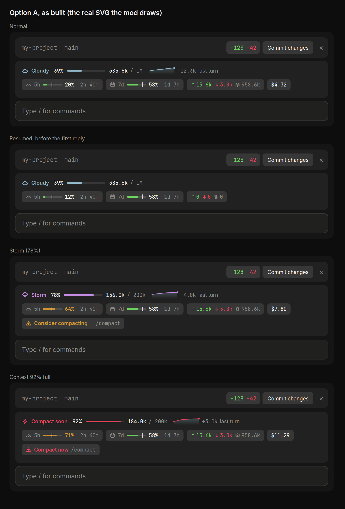
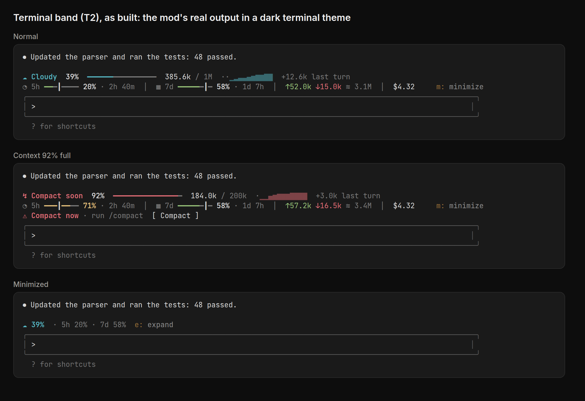
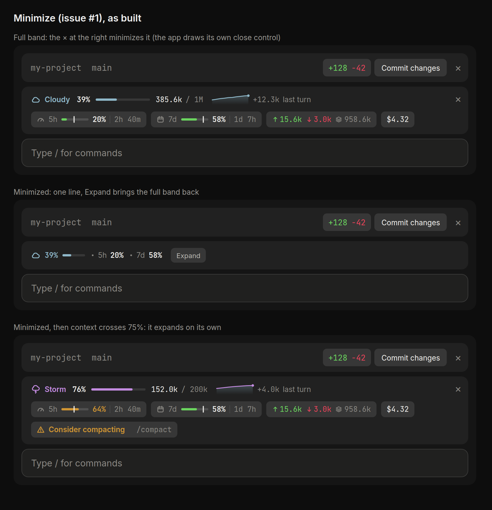

# token-weather

A Claude Code mod that shows a live forecast of your context window in the band above the prompt. A second row shows your plan limits, token counts and cost, in a dark style. Both rows update after every turn. The desktop app draws it in its own dark palette, as a forecast line over gray chips like its diff chip. The terminal draws it as plain text in the terminal's own colors, so it suits light and dark themes alike.





## What it shows

**Row 1: the forecast**

```
☂ Showers  67%  ━━━━━━━━━━━━━━━━  134.4k / 200k  ▁▂▂▃▃▄▄▅▅▆▆▇  +98.3k last turn
```

| Context used | Weather          | Color   |
| ------------ | ---------------- | ------- |
| under 25%    | ☀ Clear          | yellow  |
| 25–49%       | ☁ Cloudy         | cyan    |
| 50–74%       | ☂ Showers        | blue    |
| 75–89%       | ☇ Storm          | magenta |
| 90% and up   | ↯ Compact soon   | red     |

- **Percentage, gauge and tokens**: the input tokens of the last response, out of the model's window.
- **Chart**: the context fill at the end of each of the last 12 turns, from the lowest turn shown to the highest, so the trend reads. `·` marks turns that haven't happened yet.
- **Last turn**: how much the last turn added. After a compaction it shows how much was freed instead, in green.

**Row 2: plan windows, tokens and cost** (chips in the desktop app, separated by `│` in the terminal)

| Shown | Meaning |
| --- | --- |
| `◔ 5h ━━┃━━━━━ 20% · 2h 40m` | 5-hour plan window: the share used, a `┃` marker showing how far through the window you are, and the time until it resets |
| `▦ 7d ━━━━━━┃━ 58% · 1d 7h` | The same for the weekly window |
| `↑15.6k` | Tokens in: fresh input (uncached plus cache-written), summed over the session including subagents |
| `↓3.0k` | Tokens out: output tokens, summed the same way |
| `≋ 958.6k` | Total tokens processed: in + out + cache reads |
| `$4.32` | Session cost, as `/cost` reports it (hidden while it's zero) |
| `☇ Consider compacting` / `⚠ Compact now` | The compaction warning, shown at 75% and 90% context, with `run /compact` (in the terminal, also a **[ Compact ]** button) |

The bar fill is green when you're on pace. It turns amber when your usage is more than 10 points ahead of the time elapsed in the window, and red at 90%.

Plan-window chips only appear on a Claude subscription, because API-key sessions don't report rate limits. Claude Code reports them on each reply, so the mod remembers the last reading between sessions and shows it until the new session's first reply (a window that has reset since shows 0%).

**Warnings.** When the context crosses 75% and again at 90%, a toast fires once. The **[ Compact ]** button (hotkey `c` when the band is focused) runs a compaction, and it is hidden while a turn is running. The reset countdowns refresh every minute, and `/clear`, `/resume` and `/branch` start the forecast over.

## Minimize

The band can shrink to one line, `☁ 39% · 5h 20% · 7d 58%`:

- **Desktop app:** the **×** at the band's right edge minimizes it, and **Expand** on the mini line brings it back.
- **Terminal:** `m: minimize` and `e: expand` (click them, or focus the band with `ctrl+x tab` and press the key).
- **Anywhere:** `/token-weather mini` and `/token-weather full`.

Your choice is remembered across sessions. A minimized band expands on its own when the context crosses 75% (and again at 90%), so the compact warning is never hidden; minimize it again and it stays minimized until the next crossing.



## Install

Mods need Claude Code **v2.1.287 or later** (check with `claude --version`). The band draws in the terminal and in **local** sessions in the Claude desktop app's Code tab.

This repo is a plugin marketplace (`wazzan-mods`). In your shell (Terminal on a Mac), run:

```sh
claude plugin marketplace add wazzan/cc
claude plugin install token-weather@wazzan-mods
```

Then restart the desktop app, or run `/reload-plugins` in a session that's already open. The terminal, the desktop app's local sessions and the VS Code extension read the same `~/.claude` settings, so this one install turns the mod on in all of them, in every project.

After you've added the marketplace, you can also install from inside the desktop app: click **+** next to the prompt, then **Plugins → Add plugin**, and pick **token-weather**.

If the repository is private, `marketplace add` clones it with the git credentials already on your machine (`gh auth login` or an SSH key that works for github.com).

### Check that it loaded

Run `/plugin` in a terminal session. The dim line under the tabs should read `1 mod active · token-weather`. The band appears above the prompt straight away and fills in after the first reply.

### Update

Marketplaces you add yourself don't auto-update by default. To pull the latest version:

```sh
claude plugin marketplace update wazzan-mods
claude plugin update token-weather@wazzan-mods
```

You can also turn on auto-update in `/plugin` → **Marketplaces** → `wazzan-mods` → **Enable auto-update**.

### Where it draws

| Where you run Claude Code | Band above the prompt | `/token-weather` |
| --- | --- | --- |
| `claude` in a terminal | Yes | Yes |
| Desktop app, Code tab, local session | Yes | Yes |
| VS Code extension chat panel, `claude -p` | No | Yes |
| Cloud sessions (claude.ai/code, or a cloud session opened in the desktop app) | No, and installed plugins don't load there | No |

### Turn it off

Disable it in `/plugin` → **Installed**, or run `claude plugin disable token-weather@wazzan-mods`. The band can also be collapsed with `ctrl+x ctrl+a` and focused with `ctrl+x tab`.

## /token-weather

Prints the band as plain text, for any surface:

```
↯ Compact soon  92%  184.0k / 200k  ··········▂█  ▲ +147.9k last turn
◔ 5h ▰▰▱▱┃▱▱▱▱▱ 20% ↻ 2h 40m   ▦ 7d ▰▰▰▰▰▰▱▱┃▱ 58% ↻ 1d 7h
↑ 10.4k in   ↓ 3.0k out   ≋ 613.4k total   $4.32
⚠ Context 92% full: compact now (/compact)
Band above the prompt: drawn on desktop (12×).
```

Its last line says whether the app showing the session has asked for the band, which tells you whether the band can appear there.

## Develop

Load a working copy for one session with `claude --plugin-dir ./token-weather`; it reloads as you save.

```sh
claude plugin validate token-weather   # what the module hooks and calls
claude plugin test token-weather       # 21 tests: formatting, the band on terminal + desktop, /token-weather, saved plan windows, minimizing
```

Layout:

- `token-weather/hooks/register.tsx`: hooks `session.start`, `session.measure`, `turn.complete`, `session.compact`, `classic.SessionStart` (to restart the forecast after `/clear`, `/resume` and `/branch`), the `/token-weather` command (with `mini` and `full`) and the `AbovePrompt` render
- `token-weather/hooks/weather.ts`: pure helpers (weather bands, sparkline, bars, formatting)
- `token-weather/hooks/desktop.ts`: the desktop app's band, one transparent SVG in the app's colors
- `token-weather/types/index.d.ts`: the `$.state` contract
- `.claude-plugin/marketplace.json`: makes this repo the `wazzan-mods` marketplace
- `token-weather/tests/`: `claude plugin test` suites
